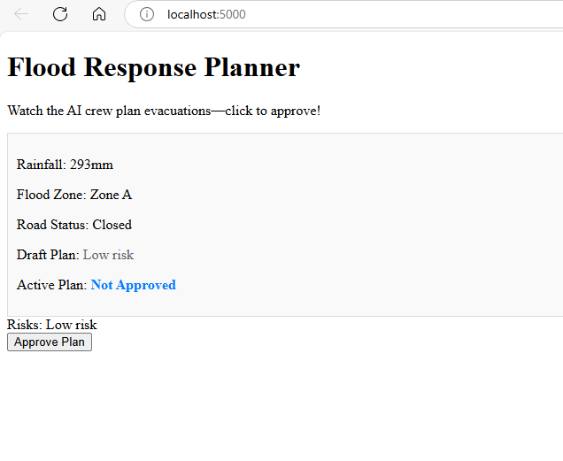
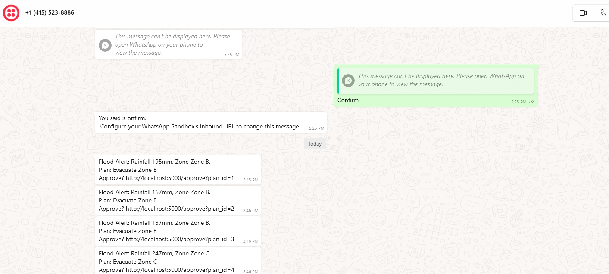

# Flood Response Planner

G’day! This is a clever AI crew that whips up disaster response plans—watching mock flood data, crafting evac routes, and tweaking them as things change. Built to show off next-gen intelligent agents!

  
*See live flood data—tap “Approve Plan” to roll out evac routes!*

## What It Does
- Watches mock flood data—like rainfall, zones, road status—updating every 5 seconds.
- Three AI mates pitch in:
  - **Sensor**: Spots risks (e.g., “High flood risk in Zone A” when rain’s heavy).
  - **Planner**: Crafts evac plans (e.g., “Evacuate Zone A via Route 1”).
  - **Refiner**: Tweaks plans if roads close (e.g., “Reroute to Route 2”).
- Shows it on a dashboard—click “Approve Plan” to roll it out!

## Tech Stuff
- **AI**: DeepSeek-R1 (7B) via Ollama for GenAI magic
- **App**: Flask + SocketIO (Python) for live updates
- **Frontend**: Simple HTML/CSS/JavaScript
- **Runs In**: Docker

## Try It Out
1. **Grab It**:
   ```bash
   git clone https://github.com/dbodduluru/flood-response-planner.git
   cd flood-response-planner